<div align="center">

# 


<br>



<br>

[](https://github.com/sajjad parcham)
[](https://github.com/sajjad parcham?tab=followers)
[](https://github.com/sajjad parcham)

</div>

---

# 👨‍🚀 About Me

```bash
> whoami
```

```text
Name        : Sajjad Parcham
Username    : sajjad parcham
Role        : Software Engineering Student
Focus       : Backend Development
Interest    : Artificial Intelligence
Learning    : Linux • Docker • PostgreSQL 
```

---

## 🚀 Current Mission

- 🔹 Building scalable REST APIs
- 🔹 Learning Distributed Systems
- 🔹 Creating AI Projects
- 🔹 Contributing to Open Source

---

## 🌌 Philosophy

> "Every commit is a step toward mastery."

---

## 🌐 Connect With Me

<p align="center">

<a href="https://github.com/sajjad parcham">

</a>

<a href="https://www.linkedin.com/">

</a>

<a href="mailto:YOUR_EMAIL">

</a>

</p>

---
## 💻 System Terminal
<!-- این بخش رو به README اضافه کن -->
<p align="center">
  
</p>

---

<p align="center">


</p>

